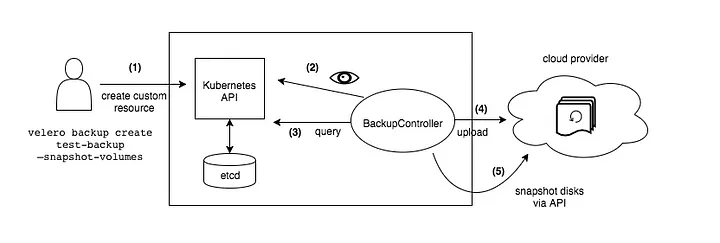
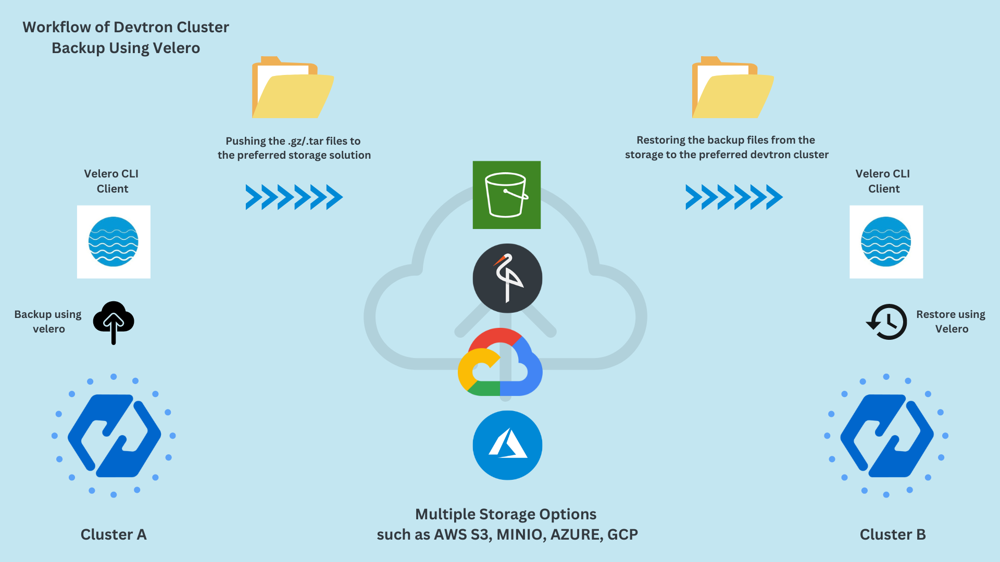
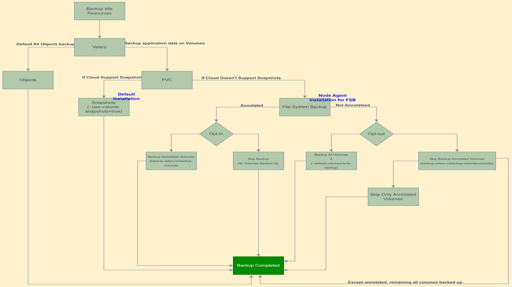

# Velero GCP Setup Summary

  

- [00 Prerequisites](./00-prerequisites.md)

- [01 GCP IAM Setup](./01-gcp-iam-setup.md)

- [02 Velero Installation](./02-velero-installation.md)

- [03 Kopia FSB Setup](./03-kopia-fsb-setup.md)

- [04 Backup Strategies](./04-backup-strategies.md)

- [05 Restore Scenarios](./05-restore-scenarios.md)

  

# Velero Overview

  

Velero is an open-source tool that provides backup, restore, and disaster recovery solutions for Kubernetes clusters, including those hosted on the Google Cloud Platform (GCP). It enables users to back up their Kubernetes resources and persistent volumes, ensuring critical data recovery in the event of accidental deletion, cluster failure, or other unforeseen issues.

---
## Velero Architecture

Velero consists of three main components:

-  **Velero Server**: Runs in the Kubernetes cluster as a Deployment. Responsible for orchestrating backups, restores, and schedules. Communicates with the Kubernetes API server.

-  **CLI (Command-Line Interface)**: Installed locally. Used by administrators to interact with the Velero server.

-  **Plugins**: Allow Velero to work with various storage backends like AWS S3, GCP, Azure. Supports block storage and object storage.

---

## How Velero Works

  1.  **Backup**: Captures Kubernetes resources (e.g., Deployments, Services, ConfigMaps, Secrets) and optionally Persistent Volume (PV) data using volume snapshots or Restic.

2.  **Restore**: Restores cluster resources and persistent data to the same or a different Kubernetes cluster.

3.  **Disaster Recovery**: Facilitates restoration to a new Kubernetes cluster after a failure.

  

---
## Importance of Velero in GCP Clusters

### Disaster Recovery

-  **Cluster Failure**: Kubernetes clusters, whether running on GKE or GCP VMs, can experience failures. Velero allows recovery of entire clusters or specific resources.

-  **Region Failover**: Velero can help migrate workloads to another region by restoring backups in a new cluster.

  

### Data Protection

-  **Accidental Deletion**: Users may accidentally delete resources such as ConfigMaps, Secrets, or Persistent Volume Claims (PVCs). Velero allows these resources to be restored quickly, minimizing downtime and data loss.

-  **Compliance**: For organizations with compliance requirements, Velero provides a way to ensure that critical data is backed up and can be restored as needed.

  

### Cluster Migration

-  **Upgrades**: During cluster upgrades or migrations (e.g., from one GKE version to another), Velero can be used to backup the current state and restore it on a new cluster, reducing the risk of data loss.

-  **Cross-Cluster Migrations**: Velero facilitates the migration of applications and data between different Kubernetes clusters, whether they are in the same cloud provider or across different providers. Migrate apps and data across Kubernetes clusters.

  

### Environment Replication

-  **Development & Testing**: Velero can be used to replicate production environments for development and testing purposes. This allows teams to work with real data in non-production environments, ensuring that tests are accurate and meaningful.
---

## Key Features

1.  **Backup**:
- **Kubernetes Resources**: Velero backs up Kubernetes resources (e.g., Deployments, Services, ConfigMaps) and stores them in object storage (such as GCP cloud storage).
- **Persistent Volumes**: Velero can also back up Persistent Volumes, ensuring that the data stored in them is not lost during backup and restore operations.

2.  **Restore**:

- **Granular Restore**: Velero allows you to restore entire clusters or specific resources, providing flexibility depending on the scenario.
- **Namespace-Level Restore**: Users can restore resources within a specific namespace, making it easier to recover only the affected parts of a cluster.

3.  **Migration**:

- **Cross-Cluster Migration**: Velero supports migrating Kubernetes resources and Persistent Volumes between clusters, enabling easy movement of workloads across environments.

4.  **Scheduling**:

- **Automated Backups**: Velero supports scheduling automated backups at regular intervals, ensuring that the most recent state of the cluster is always backed up.Automated backups at regular intervals.

5.  **Cloud Integration**:

- **GCP Integration**: Velero integrates seamlessly with GCP services, such as cloud storage for storage and IAM for access control, making it an ideal choice for GKE clusters.
---

## Visual Summary

